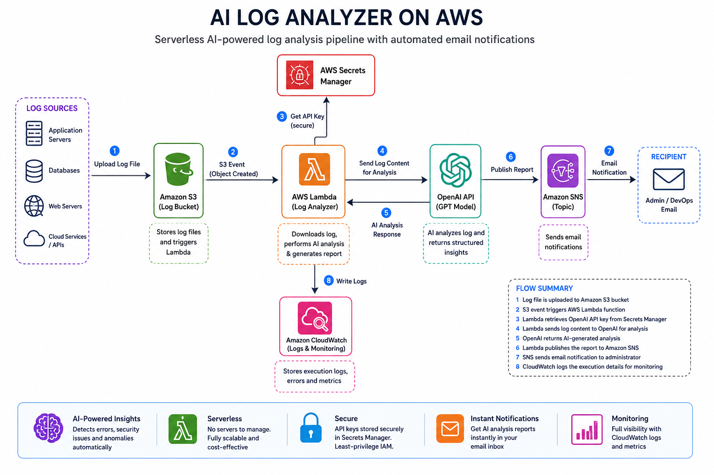
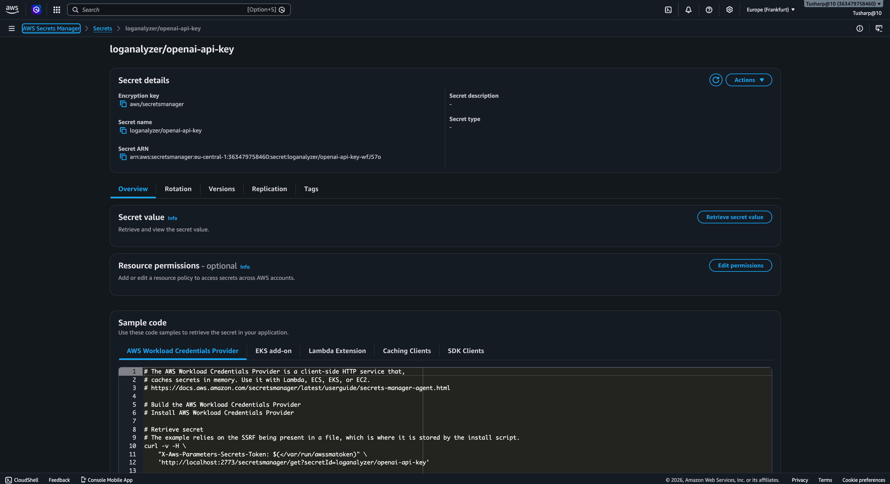
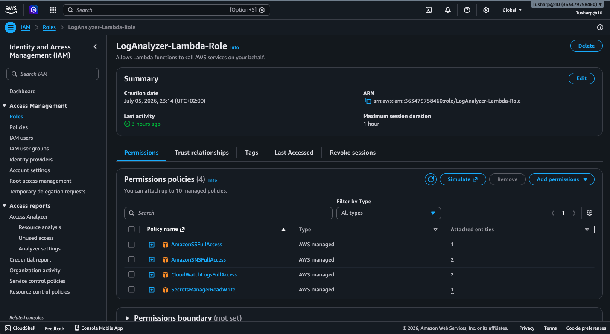
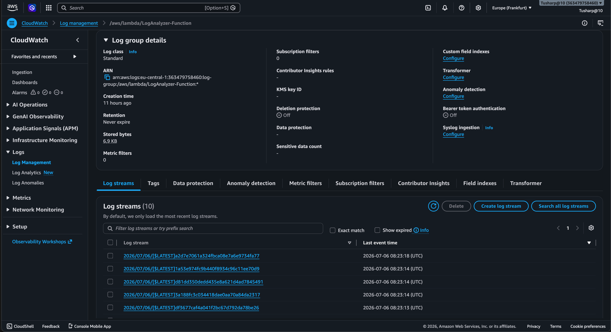
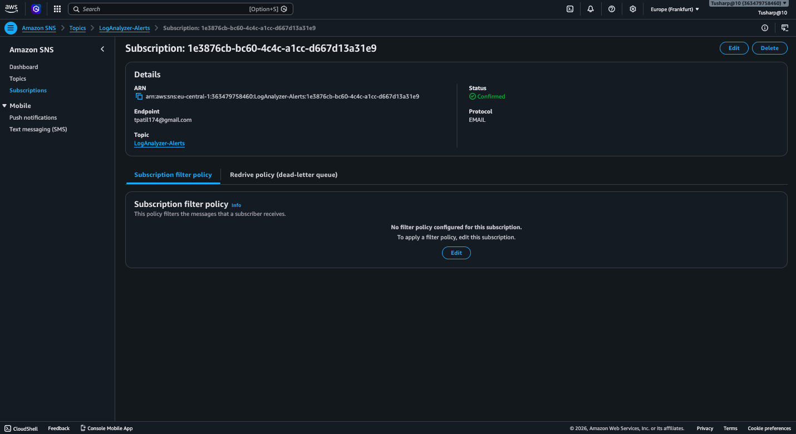
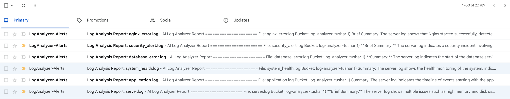
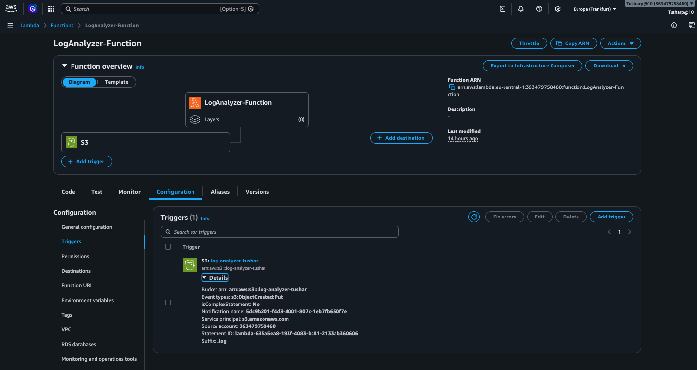
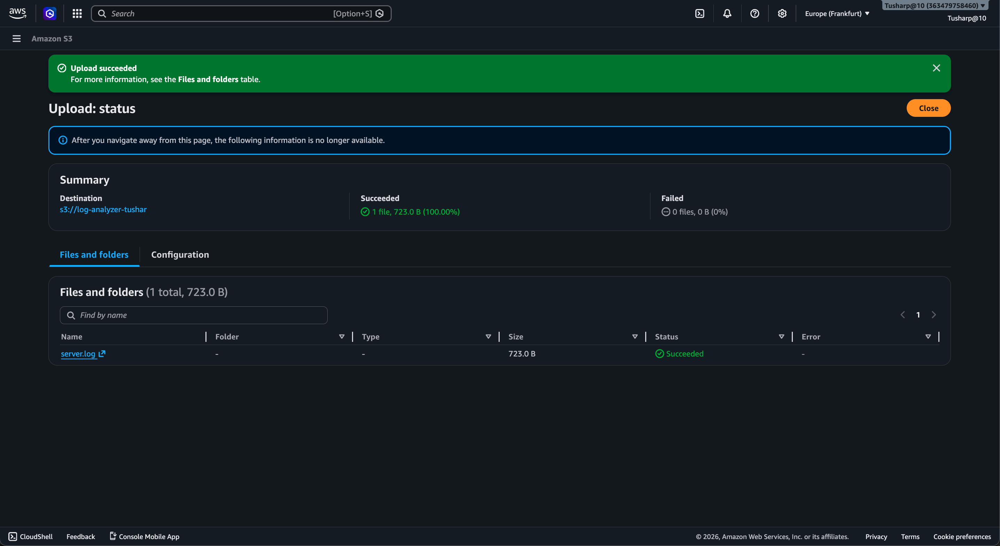

# 🤖 AI Log Analyzer on AWS

> Production-ready serverless AI Log Analyzer built with **AWS Lambda, Amazon S3, Amazon SNS, CloudWatch, IAM, Secrets Manager, and OpenAI GPT**.

Automatically detects errors inside uploaded log files, generates an AI-powered analysis report, stores the report in Amazon S3, and sends the result via email using Amazon SNS.

---

# 🚀 Project Overview

This project demonstrates a complete serverless AI pipeline on AWS.

Instead of manually reading thousands of log lines, the application automatically:

- Uploads log files
- Triggers AWS Lambda
- Reads log contents
- Sends logs to OpenAI GPT
- Generates an intelligent analysis
- Stores the report in Amazon S3
- Emails the final report to the administrator

Everything is fully automated.

---

# 🏗 Architecture

```
              Sample Log File
                     │
                     ▼
            Amazon S3 Bucket
                     │
      Object Created Event Trigger
                     │
                     ▼
          AWS Lambda (Python 3.12)
                     │
     ┌───────────────┼────────────────┐
     │               │                │
     ▼               ▼                ▼
OpenAI API     Secrets Manager   CloudWatch
     │
     ▼
AI Analysis Report
     │
     ▼
Amazon S3 (Reports)
     │
     ▼
Amazon SNS
     │
     ▼
Email Notification
```

---

## 📷 Architecture Diagram



---

# ✨ Key Features

- AI-powered log analysis using OpenAI GPT
- Fully serverless AWS architecture
- Automatic Lambda trigger from S3 upload
- Secure API key storage using Secrets Manager
- CloudWatch monitoring
- Email notifications through SNS
- AI-generated incident reports
- Production-style IAM permissions
- Sample logs included for testing

---

# 🛠 AWS Services Used

| Service | Purpose |
|----------|----------|
| AWS Lambda | Process uploaded logs |
| Amazon S3 | Store logs and AI reports |
| Amazon SNS | Email notification |
| CloudWatch | Monitoring & logging |
| IAM | Secure permissions |
| Secrets Manager | Store OpenAI API Key |

---

# 🧠 AI Workflow

1. Upload a log file into S3.
2. S3 triggers Lambda automatically.
3. Lambda downloads the log.
4. Lambda retrieves the OpenAI API key from Secrets Manager.
5. OpenAI analyzes the log.
6. AI report is generated.
7. Report is uploaded to S3.
8. SNS sends an email with the analysis result.

---

# 📸 Project Screenshots

---

## 💻 Lambda Function

Core Python function that processes uploaded logs and communicates with OpenAI.


---

## 🔐 AWS Secrets Manager

The OpenAI API Key is securely stored inside AWS Secrets Manager instead of hardcoding sensitive information into the application.



---

## 👤 IAM Role & Permissions

AWS IAM provides secure access between S3, Lambda, Secrets Manager, CloudWatch, and SNS using least-privilege permissions.



---

## 📊 CloudWatch Monitoring

CloudWatch captures execution logs for every Lambda invocation, enabling monitoring, debugging, and auditing.



---

## 📧 Amazon SNS Email Subscription

Amazon SNS delivers AI-generated reports directly to the registered email address.



---

## 📨 AI Log Analysis Report

Sample email received after successful AI analysis.



------

## ⚡ Lambda Trigger from Amazon S3

Whenever a new log file is uploaded into the S3 bucket, an ObjectCreated event automatically invokes the Lambda function.



---

## 📂 AI Report Stored in Amazon S3

After OpenAI analyzes the uploaded log, the generated report is automatically saved back into Amazon S3.



---

# 📄 Sample Log Files

The repository includes several sample log files for testing.

```
sample_logs/
├── application.log
├── database_error.log
├── nginx_error.log
├── security_alert.log
├── server.log
└── system_health.log
```

These logs simulate real-world scenarios including:

- Application exceptions
- Database connection failures
- Security alerts
- Nginx server errors
- System health monitoring
- General server logs

Simply upload any of these files to the configured S3 bucket to test the complete AI workflow.

---

# 📁 Project Structure

```
AI-Log-Analyzer/
│
├── images/
│   ├── Architecture-Overview.png
│   ├── aws-secrets-manager.png
│   ├── cloudwatch-execution-logs.png
│   ├── email-analysis-report.png
│   ├── iam-role-permissions.png
│   ├── lambda-code.png
│   ├── lambda-s3-trigger.png
│   ├── s3-upload-success.png
│   └── sns-email-subscription.png
│
├── sample_logs/
│   ├── application.log
│   ├── database_error.log
│   ├── nginx_error.log
│   ├── security_alert.log
│   ├── server.log
│   └── system_health.log
│
├── lambda_function.py
└── README.md
```

---

# ▶️ How to Run

### 1. Clone the repository

```bash
git clone https://github.com/tpatil174/AI-Log-Analyzer.git
```

### 2. Create AWS resources

- Amazon S3 Bucket
- AWS Lambda Function
- IAM Role
- Amazon SNS Topic
- CloudWatch
- AWS Secrets Manager

### 3. Store your OpenAI API Key

Create a secret in AWS Secrets Manager:

```
OPENAI_API_KEY
```

---

### 4. Deploy Lambda

Upload:

```
lambda_function.py
```

Install the required dependencies and deploy them with your Lambda package.

---

### 5. Configure the S3 Trigger

Configure an **ObjectCreated** event notification to invoke the Lambda function whenever a new log file is uploaded.

---

### 6. Test

Upload one of the files from:

```
sample_logs/
```

The system will automatically:

- Trigger Lambda
- Analyze the log with OpenAI
- Generate an AI report
- Save the report to S3
- Send an email via Amazon SNS

---

# 💡 Skills Demonstrated

- AWS Lambda
- Amazon S3
- Amazon SNS
- CloudWatch Monitoring
- AWS IAM
- AWS Secrets Manager
- Python (boto3)
- OpenAI API Integration
- Event-Driven Architecture
- Serverless Computing
- Cloud Security Best Practices
- Infrastructure Automation

---

# 🚀 Future Improvements

- Dashboard using Amazon QuickSight
- Support for multiple AI models
- Multi-file batch processing
- Severity scoring
- Slack & Microsoft Teams notifications
- CloudFormation / Terraform deployment
- Web dashboard using React
- Amazon EventBridge scheduling
- Historical analytics and trends

---

# 👨‍💻 Author

**Tushar Patil**

AWS | Python | SQL | Cloud Automation | AI Integration | DevOps Enthusiast

GitHub:

https://github.com/tpatil174

---

# ⭐ If you found this project useful

Please consider giving this repository a ⭐ on GitHub.

It helps others discover the project and supports future improvements.

---

# 📄 License

This project is intended for educational purposes and portfolio demonstration.

Feel free to fork, learn from, and build upon it.
