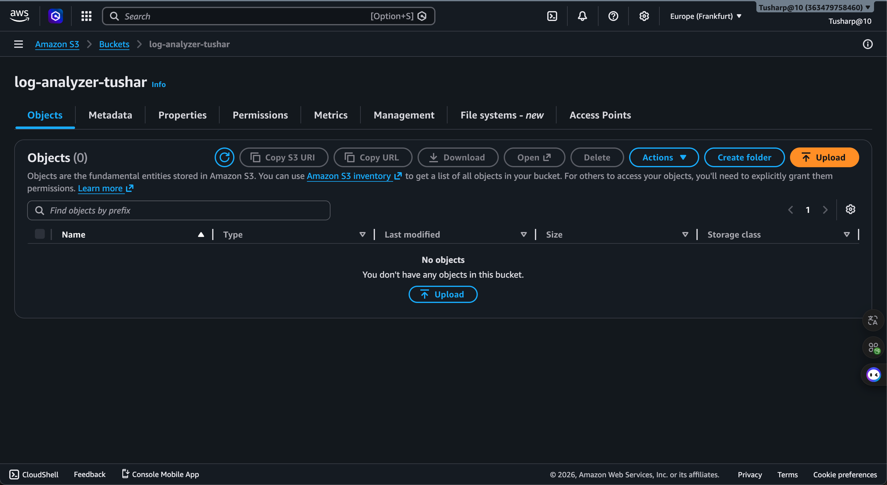

# 🤖 AI Log Analyzer on AWS


An **AI-powered serverless log analysis system** built entirely on **AWS** that automatically analyzes uploaded log files using **OpenAI**, detects potential issues and security events, generates intelligent summaries, and sends email reports using Amazon SNS.

This project demonstrates modern cloud architecture, serverless computing, infrastructure automation, AI integration, monitoring, and security best practices.

---

# 📌 Table of Contents

- Project Overview
- Why This Project?
- Architecture
- Workflow
- Features
- AI Analysis Pipeline
- AWS Services Used
- Technologies Used
- Project Structure
- Screenshots
- Setup Guide
- Testing
- Live Results
- Security
- Skills Demonstrated
- Future Improvements
- Cost Estimation
- License

---

# 🚀 Project Overview

Modern production systems generate thousands of log files every day.

Manually reading logs to identify:

- Application errors
- Database failures
- Security incidents
- Infrastructure warnings
- Performance bottlenecks

is slow and inefficient.

This project automates that entire workflow.

Whenever a log file is uploaded into Amazon S3:

1. Lambda automatically starts
2. The log is downloaded
3. OpenAI analyzes the content
4. A professional incident report is generated
5. The report is emailed instantly
6. CloudWatch stores execution logs

No servers.

No manual intervention.

Everything is event-driven.

---

# 🎯 Why This Project?

Traditional monitoring systems only send alerts when predefined rules are matched.

This project goes a step further by using AI to understand the context of log files.

Instead of receiving raw log entries, administrators receive:

- Executive summary
- Severity assessment
- Possible root causes
- Security observations
- Recommended next steps

This simulates how modern DevOps, Cloud Engineers, and Site Reliability Engineers (SREs) use AI for intelligent observability.

---

# 🏗 Architecture


```

```text
                  Upload Log File
                        │
                        ▼
                Amazon S3 Bucket
                        │
              Object Created Event
                        │
                        ▼
              AWS Lambda Function
                        │
        ┌───────────────┼────────────────┐
        │               │                │
        ▼               ▼                ▼
Secrets Manager     OpenAI API      CloudWatch Logs
        │
        ▼
 AI Log Analysis
        │
        ▼
 Amazon SNS
        │
        ▼
 Email Notification
```

---

# ⚙️ Workflow

1. User uploads a log file to Amazon S3.

2. Amazon S3 automatically triggers AWS Lambda.

3. Lambda downloads the uploaded log.

4. Lambda retrieves the OpenAI API Key securely from AWS Secrets Manager.

5. The log content is sent to OpenAI.

6. OpenAI generates:

- Executive summary
- Incident analysis
- Security observations
- Recommendations

7. Lambda creates a formatted report.

8. Amazon SNS sends the report by email.

9. CloudWatch stores execution logs.

Everything happens automatically within seconds.

---

# ⭐ Features

| Feature | Description |
|----------|-------------|
| AI Log Analysis | Intelligent log understanding using OpenAI |
| Automatic Processing | S3 event automatically triggers Lambda |
| Secure Secret Storage | API key stored in AWS Secrets Manager |
| Email Alerts | AI report sent using Amazon SNS |
| Cloud Monitoring | CloudWatch execution logs |
| Serverless | No EC2 or server management |
| Event Driven | Uploading a file starts the workflow |
| Security Detection | AI identifies suspicious events |
| Error Detection | Database and application failures detected |
| Infrastructure Monitoring | System health logs analyzed |

---

# 🧠 AI Analysis Pipeline

```

```text
Log File

↓

Amazon S3

↓

AWS Lambda

↓

Secrets Manager
(API Key)

↓

OpenAI GPT

↓

AI Analysis

↓

Professional Report

↓

Amazon SNS

↓

Email Notification
```

The generated report contains:

- Brief Summary
- Major Findings
- Error Detection
- Security Risks
- Recommended Actions
- Severity Assessment

Unlike keyword matching, the AI understands the overall meaning of the logs and provides contextual insights.

---

# ☁️ AWS Services Used

| AWS Service | Purpose |
|-------------|---------|
| **Amazon S3** | Stores uploaded log files and triggers Lambda events |
| **AWS Lambda** | Processes uploaded logs and invokes OpenAI API |
| **Amazon SNS** | Sends AI-generated log analysis reports via email |
| **Amazon CloudWatch** | Monitors Lambda execution and stores logs |
| **AWS Secrets Manager** | Securely stores the OpenAI API Key |
| **AWS IAM** | Provides secure permissions between AWS services |

---

# 💻 Technologies Used

| Technology | Usage |
|------------|------|
| Python 3.12 | Backend programming language |
| boto3 | AWS SDK for Python |
| OpenAI API | AI-powered log analysis |
| AWS Lambda | Serverless compute |
| Amazon S3 | Object storage |
| Amazon SNS | Email notifications |
| Amazon CloudWatch | Monitoring and logging |
| AWS IAM | Identity & Access Management |
| AWS Secrets Manager | Secret management |
| Git & GitHub | Version control |

---

# 📂 Project Structure

```text
AI-Log-Analyzer/
│
├── lambda_function.py
├── requirements.txt
├── README.md
│
├── sample_logs/
│   ├── application.log
│   ├── database_error.log
│   ├── nginx_error.log
│   ├── security_alert.log
│   ├── server.log
│   └── system_health.log
│
├── images/
│   ├── architecture.png
│   ├── s3-upload.png
│   ├── lambda-function.png
│   ├── lambda-code.png
│   ├── iam-role.png
│   ├── secrets-manager.png
│   ├── cloudwatch-logs.png
│   ├── sns-subscription.png
│   └── email-notification.png
│
└── LICENSE
```

---

# 📸 Screenshots

## 📤 Upload Log File to Amazon S3

The user uploads a log file to the Amazon S3 bucket. The upload automatically triggers the serverless workflow.


---

## ⚡ AWS Lambda Trigger

Amazon S3 automatically invokes the Lambda function whenever a new log file is uploaded.


---

## 🐍 Lambda Function Code

The Lambda function performs the following tasks:

- Downloads the uploaded log
- Retrieves the OpenAI API Key
- Sends the log to OpenAI
- Receives the AI analysis
- Sends the report through Amazon SNS



---

## 🔐 AWS Secrets Manager

The OpenAI API Key is securely stored inside AWS Secrets Manager instead of hardcoding sensitive information into the application.


---

## 👤 IAM Role & Permissions

AWS IAM provides secure access between S3, Lambda, Secrets Manager, CloudWatch, and SNS using least-privilege permissions.


---

## 📊 CloudWatch Monitoring

CloudWatch captures execution logs for every Lambda invocation, enabling monitoring, debugging, and auditing.


---

## 📧 Amazon SNS Email Subscription

Amazon SNS delivers AI-generated reports directly to the registered email address.


---

## 📩 AI Log Analysis Report

Sample email received after successful AI analysis.

The report contains:

- Executive Summary
- Error Detection
- Security Observations
- Recommendations
- Severity Assessment


---

# ⚙️ Installation & Setup

## Clone Repository

```bash
git clone https://github.com/yourusername/AI-Log-Analyzer.git

cd AI-Log-Analyzer
```

---

## Install Dependencies

```bash
pip install -r requirements.txt
```

---

## Configure AWS

Create:

- Amazon S3 Bucket
- AWS Lambda Function
- SNS Topic
- CloudWatch Log Group
- IAM Role
- Secrets Manager Secret

---

## Store OpenAI API Key

Navigate to:

AWS Console

↓

Secrets Manager

↓

Create Secret

↓

Store:

```text
OPENAI_API_KEY
```

---

## Deploy Lambda

Upload:

```
lambda_function.py
```

along with required dependencies.

---

## Configure S3 Trigger

Inside Lambda:

Add Trigger

↓

Amazon S3

↓

ObjectCreated Event

↓

Save

---

## Configure SNS

Create Topic

↓

Create Email Subscription

↓

Confirm Email

---

## Upload Sample Logs

Upload:

- server.log
- application.log
- nginx_error.log
- database_error.log
- security_alert.log
- system_health.log

The complete workflow executes automatically.

---
